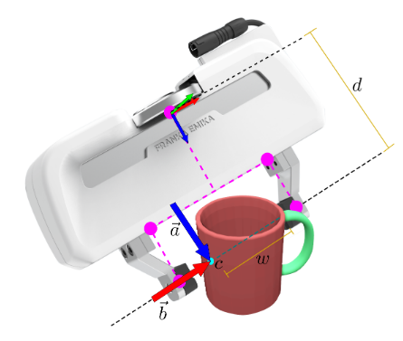

 


Step 1 install docker 
```
https://docs.docker.com/desktop/setup/install/linux/ubuntu/
```

```
curl -fsSL https://nvidia.github.io/libnvidia-container/gpgkey | sudo gpg --dearmor -o /usr/share/keyrings/nvidia-container-toolkit-keyring.gpg
```
```
curl -s -L https://nvidia.github.io/libnvidia-container/stable/deb/nvidia-container-toolkit.list | \
  sed 's#deb https://#deb [signed-by=/usr/share/keyrings/nvidia-container-toolkit-keyring.gpg] https://#g' | \
  sudo tee /etc/apt/sources.list.d/nvidia-container-toolkit.list
```

```
sudo apt-get update
```

```
sudo apt-get install -y nvidia-container-toolkit
```

```
sudo nvidia-ctk runtime configure --runtime=docker
sudo systemctl restart docker
```

```
sudo usermod -aG docker $USER
```

```
newgrp docker
```

Allow docker to use your display

```
xhost +local:docker
```

```
docker compose build
```

```
newgrp docker
docker compose run graspomatic bash
```

```
python3 final_improved.py
```

